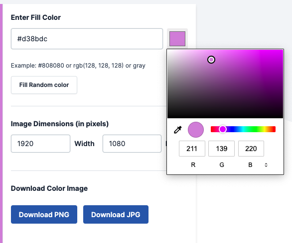
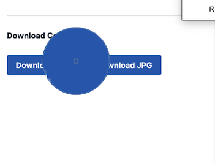

#This will contain a bunch of mark up samples when I forget when to do something particular

#importing font(s) google
```css
    
    @import url('https://fonts.googleapis.com/css2?family=nameoffont&display=swap');

```
    sometimes I forget the following &display=swap at the end

### useful link for colours 

https://mdigi.tools/solid-color-image-generator/

click on the small coloured square it will bring up the following



then 

click on the following


then it will bring up a circle you can hover over any area of the screen to get the colour you want

